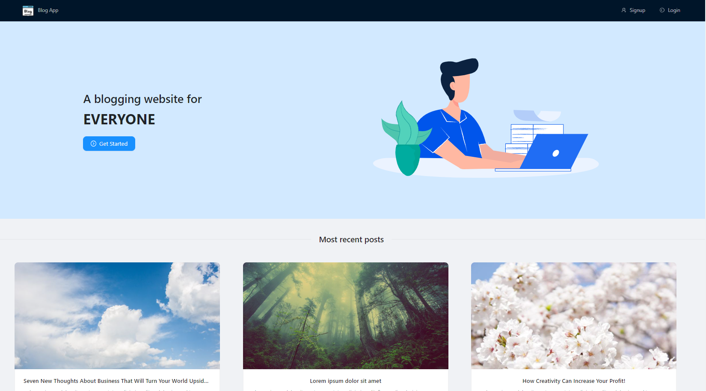
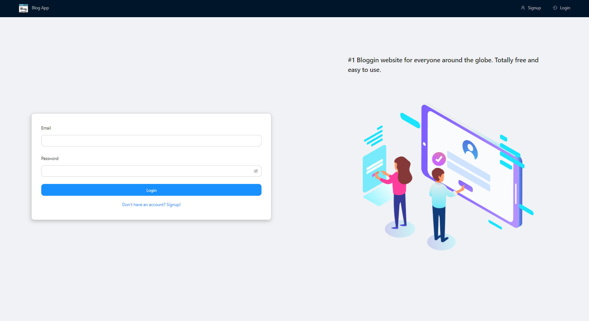

# MERN-Blog

## Table of contents

- [Introduction](#introduction)
- [Demo](#demo)
- [Features](#features)
- [Technology](#technology)
- [Database Models](#database)
- [Run](#run)
- [License](#license)

## Introduction

A virtual blog application using the MERN stack (MongoDB, Express js, React js, and Node js).

## Demo

This application is deployed on Heroku and can be accessed through the following link:

[MERN Blog on Heroku](https://mern-blog-01.herokuapp.com/)

## Technology

The main technologies used to build this application are:

- Node.js version 14.16.0
- MongoDB version 4.4.3
- Express.js version 4.17.1
- React.js version 17.0.1
- Antd, a React UI Framework, version 4.12.3

## Features

A blog app with the following features.

Unlogged in users can do the following:

- View all posts.
- View one post's content by clicking on it.
- View post's comments.
- View any user's profile.
- Signup.

In addition to the above points, logged in users can do the following:

- Login or logout.
- Create a new post.
- View/Edit/delete their posts.
- Edit their user profile or password.
- Add a new comment on a post.
- View/Edit/Delete their comments.

## Database

All the models can be found in the models directory created using mongoose.

### User Schema:

- userName (String)
- email (String)
- password (String)
- summary (String)
- imagePath (String)

### Post Schema:

- title (String)
- content (String)
- imagePath (String)
- createdAt (Date)
- createdBy (ObjectID - a reference to the user's table)
- comments (ObjectID - an array of comments on the post)

### Comment Schema:

- content (String)
- createdAt (Date)
- createdBy (ObjectID - a reference to the user's table)

## Run

To run this application (the master branch), you have to set your own environmental variables in the server root folder. For security reasons, some variables have been hidden from view and used as environmental variables with the help of dotenv package. Below are the variables that you need to set in order to run the application:

- MONGO_URI: this is the connection string of your MongoDB Atlas database.

- SECRET_KEY: you can provide any string here, it is used to encrypt the JWT authentication token.

After you've set these environmental variables in the .env file at the root of the server folder, you need to navigate to the "seedDB" folder and run "node -r esm seedPosts.js" and "node -r esm seedUsers.js" to fill your empty MongoDB Atlas database.

Now that the database has data and the environmental variables are all set, you should run the two folders, the client and server together to run the application. Open two terminals, navigate to the client in one and to the server in another, run "npm start" in both terminals and the application should start.

## License

- MIT License
- Copyright 2021 © [Maryam Aljanabi](https://github.com/maryamaljanabi)
